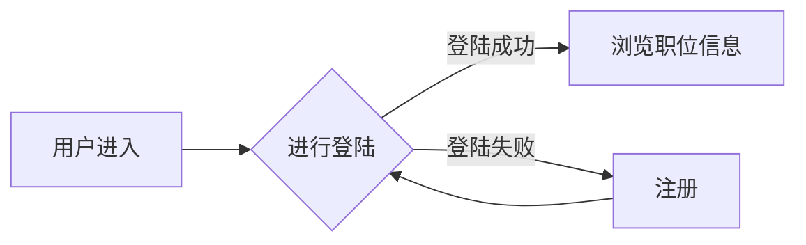
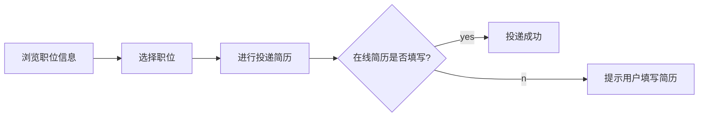
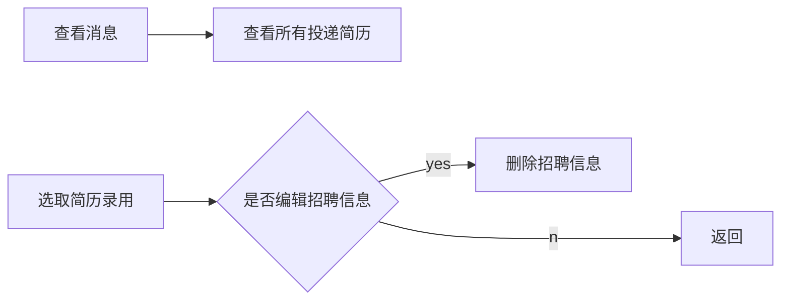

# 1. 引言

## 1.1 编写目的

随着经济的发展，国内企业越来越多，所需的人才缺口也越来越大。线下的招聘也逐渐的显示出来他它的不足。与传统的线下招聘相比，网上招聘具有的低成本，速度快，高灵活性时线下招聘所不具备的。网上招聘能够提供更加丰富的资源，更加灵活的交谈方式。设计一个网上招聘网站能够方便公司的人事部进行高效的人才招聘，提高工作效率，同时也能让公司找到更加满意的人才。

# 2 功能需求

## 2.1 主要功能

针对求职者：

-   登陆注册功能
-   个人简历上传功能
-   在线简历编辑功能
-   职位查找功能
-   投递简历功能
-   职位申请记录功能
-   账号信息功能

-   线上聊天功能

针对招聘者：

-   查看所有应聘者简历
-   需求发布
-   修改发布
-   搜索求职者
-   挑选求职者后，需求信息相应修改功能

-   线上聊天

针对管理员：

-   需求信息发布审核

# 3 数据库设计

用户注册表（user_reg）

| 字段名     | 字段类型 | 字段约束       | 字段描述   |
|------------|----------|----------------|------------|
| user_pwd   | string   | not null       | user_pwd   |
| user_name  | string   | not null       | user_name  |
| user_email | string   | not null union | user_email |
| reg_id     | number   | not null pk    | 注册 id    |

用户信息表（user_info）

| 字段名     | 字段类型 | 字段约束    | 字段描述   |
|------------|----------|-------------|------------|
| user_id    | number   | not null pk | user_id    |
| user_name  | string   | not null    | user_name  |
| user_sex   | bool     | not null    | user_sex   |
| user_phone | string   | not null    | user_phone |
| user_addr  | string   | not null    | user_phone |
| reg_time   | date     | not null    | 注册时间   |

简历表（cv）

| 字段名           | 字段类型 | 字段约束    | 字段描述 |
|------------------|----------|-------------|----------|
| cv_id            | number   | not null pk | cv_id    |
| cv_name          | string   | not null    | cv_name  |
| cv_picture       | string   | none        | 头像地址 |
| cv_birth         | date     | not null    | cv_birth |
| cv_phone         | string   | not null    | cv_phone |
| cv_email         | string   | not null    | cv_email |
| cv_addr          | string   | not null    | cv_addr  |
| cv_education     | string   | not null    | 学历信息 |
| cv_major         | string   | not null    | 专业信息 |
| cv_school        | string   | not null    | 毕业院校 |
| cv_before_school | date     | not null    | 入学日期 |
| cv_after_school  | date     | not null    | 毕业日期 |
| cv_expect_salary | number   | not null    | 期望薪资 |
| cv_certificate   | string   | none        | 个人证书 |
| cv_belong_to     | number   | not null fk | 用户     |

公司注册表（com_reg）

| 字段名    | 字段类型 | 字段约束       | 字段描述  |
|-----------|----------|----------------|-----------|
| reg_id    | number   | not null pk    | 注册 id   |
| com_name  | string   | not null       | 公司名称  |
| com_pwd   | string   | not null       | com_pwd   |
| com_email | string   | not null union | com_email |

公司信息表（com_info）

| 字段名        | 字段类型 | 字段约束    | 字段描述     |
|---------------|----------|-------------|--------------|
| com_id        | number   | not null pk | com_id       |
| com_name      | string   | not null    | com_name     |
| com_email     | string   | not null    | com_email    |
| com_web       | string   | none        | com_web      |
| com_addr      | string   | not null    | com_addr     |
| com_phone     | string   | not null    | com_phone    |
| com_date      | date     | not null    | com_date     |
| com_scope     | string   | not null    | 公司规模     |
| com_tyoe      | string   | not null    | 公司类型     |
| com_logo_addr | string   | not null    | 公司logo地址 |

招聘信息表（recruit）

| 字段名        | 字段类型 | 字段约束     | 字段描述       |
|---------------|----------|--------------|----------------|
| rec_id        | number   | not null pk  | rec_id         |
| rec_title     | string   | not null     | rec_title      |
| rec_content   | string   | not null     | rec_content    |
| rec_salary    | string   | not null     | 薪资范围       |
| rec_education | string   | not null     | 学历要求       |
| rec_req_time  | string   | not null     | 时间要求       |
| rec_require   | string   | not null     | 岗位要求       |
| rec_welfare   | string   | not null     | 岗位福利       |
| rec_time      | date     | not null     | 发布时间       |
| rec_person    | string   | not null     | 发布人员       |
| rec_com       | number   | not null  fk | 发布公司id     |
| rec_state     | bool     | not null     | 是否在审核阶段 |

简历投递表（cv_delever）

| 字段名  | 字段类型 | 字段约束    | 字段描述 |
|---------|----------|-------------|----------|
| cd_id   | number   | not null pk | cd_id    |
| cd_cv   | number   | not null fk | cd_cv    |
| cd_rec  | number   | not null fk | cd_rec   |
| cd_time | number   | not null    | 投递时间 |

# 4 流程图

## 4.1 用户登陆

## 4.2 简历填写

## 4.3 求职

## 4.4 公司招聘

   